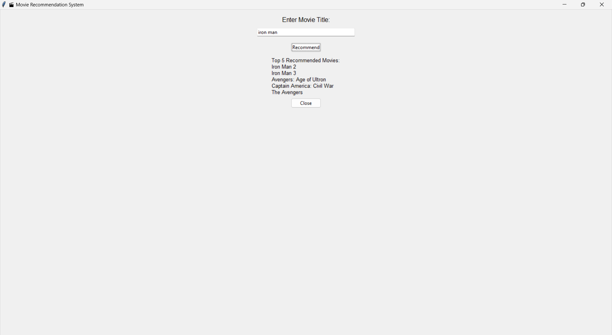

## 🎬 Movie Recommendation System using Python & GUI (Tkinter)

This project is a simple content-based movie recommendation system built using Python. It recommends movies based on user input using cosine similarity on movie overviews. The project includes a minimal graphical user interface (GUI) made with Tkinter.

---

## 🔧 Technologies Used

- Python  
- Pandas, NumPy, Scikit-learn  
- Tkinter (for GUI)  
- Jupyter/VS Code (for development)

---

## 📌 Features

- Load and clean a dataset of movies (`movies.csv`)  
- Combine with credits metadata (`credits.csv`)  
- Process text to generate similarity scores  
- Recommend top 5 similar movies based on description  
- Easy-to-use GUI for entering movie names and getting results instantly

---

## 🖼️ GUI Preview

Here’s how the GUI looks when it runs:

|     GUI    | Recommendations  |
|------------|------------------|
|  |  |


---

## 📁 Dataset (Not Included Due to Size Limit)

To run this project, you’ll need two datasets:

- `movies.csv`  
- `credits.csv` *(⚠️ File size > 25MB, included as ZIP in this repo)*

---

## 🚀 How to Run

1. Make sure Python is installed  
2. Install dependencies:
   ```bash
   pip install pandas numpy scikit-learn
Run the app: app.py
bash
Copy
Edit
python movie.py
A small window will appear — type a movie name and hit Recommend

## 🚀 Future Improvements

Add support for fuzzy matching if the title is misspelled
Switch to a Flask-based web UI
Integrate poster and IMDb links in output
Add genre/tag-based filtering

## ✍️ Author
**Prabhakar Rayal**  
B.Tech CSE | Graphic Era Hill University  
📍 Rishikesh, Uttarakhand, India  
[GitHub Profile](https://github.com/Prabhakarrayal), | [LinkedIn Profile](https://in.linkedin.com/in/prabhakar-rayal-6639682) | [PORTFOLIO](https://prabhakar-rayal-gtz3vl4.gamma.site/)
